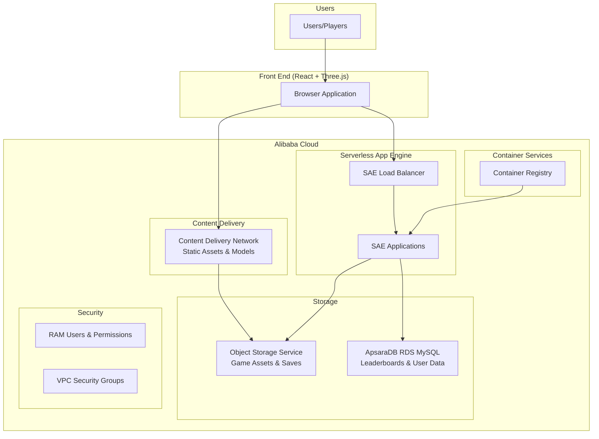
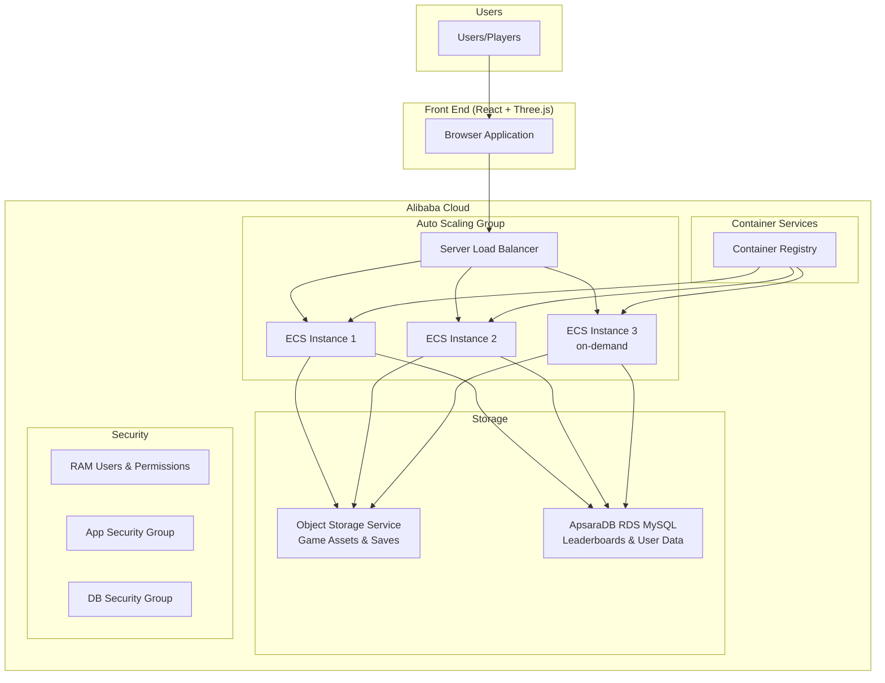

# RoboVerse

A 3D robot-themed web game built with React, Three.js, and Alibaba Cloud services.

See it live: https://roboverse.humanless.app/

## Features

- Interactive 3D robot building and customization
- Real-time robot battles with physics
- Cloud-based save system using Alibaba Cloud OSS
- Global leaderboards powered by ApsaraDB

## Prerequisites

- Node.js (compatible with React 19)
- Docker and Docker Compose
- Terraform (optional, for cloud deployment)
- MySQL 8.0 (automatically handled by Docker)

## Setup

1. Clone the repository
2. Install dependencies:
```bash
npm install
```

3. Create a `.env` file in the root directory with your database and server configuration:
```env
# API Server Config
PORT=3001

# Frontend Config
VITE_API_URL=http://localhost:3001/api

# Database Config (Docker)
DB_HOST=localhost
DB_USER=root
DB_PASSWORD=rootpassword
DB_NAME=roboverse
DB_PORT=3306

# Alibaba Cloud Config (Server-side only)
ALIBABA_OSS_REGION=your-region
ALIBABA_OSS_BUCKET=your-bucket
ALIBABA_ACCESS_KEY_ID=your-access-key
ALIBABA_ACCESS_KEY_SECRET=your-secret-key
```

4. Start the MySQL database with Docker:
```bash
docker-compose up -d
```

The database will be automatically initialized with the schema and initial data from `server/db/init.sql`.

5. Start the development servers:
```bash
npm run dev:all
```

This will start both the frontend and backend servers in development mode.

## Available Scripts

- `npm run dev` - Start the frontend development server
- `npm run server:dev` - Start the backend server with hot reload
- `npm run dev:all` - Start both frontend and backend in development mode
- `npm run build` - Build the frontend for production
- `npm run start` - Run the production server
- `npm run lint` - Run ESLint checks
- `npm test` - Run all tests
- `npm run test:frontend` - Run frontend tests with Vitest
- `npm run test:backend` - Run backend tests with Jest
- `npm run test:coverage` - Generate test coverage report
- `npm run test:ui` - Run tests with UI interface

### Terraform Commands
- `npm run terraform:init` - Initialize Terraform workspace
- `npm run terraform:plan` - Preview infrastructure changes
- `npm run terraform:apply` - Apply infrastructure changes

## Development Modes

### Full Stack Development
The default mode with both frontend and backend servers running:
```bash
npm run dev:all
```

### Local Development
For frontend-only development without backend dependencies:
1. Create a `.env.local` file
2. Comment out the `VITE_API_URL` variable
3. Run `npm run dev`

This will enable local storage mode for testing frontend features without a backend.

## Testing

The project uses two testing frameworks:
- **Vitest** for frontend tests
  - React Testing Library for component testing
  - MSW for API mocking
  - Test environment: jsdom
- **Jest** for backend tests
  - Supertest for API testing
  - Coverage reporting available

## Architecture

- Frontend: React with TypeScript
- 3D Graphics: Three.js with React Three Fiber
- State Management: Zustand
- Database: MySQL 8.0 (containerized)
- Cloud Infrastructure:
  - Alibaba Cloud ECS for hosting
  - Alibaba Cloud OSS for asset storage
  - ApsaraDB for player data and leaderboards

## Development

The project is structured as follows:
- `/src/components` - React components including 3D models
- `/src/services` - Cloud service integrations
- `/src/store` - Game state management
- `/src/assets` - Static assets and models
- `/server` - Backend API and database setup

## Robot Builder

The robot builder allows players to create custom robots with different parts:

### Parts Categories
- **Heads**: Standard, Battle, Scout - affects perception and targeting
- **Bodies**: Light, Medium, Heavy - determines base health and defense
- **Arms**: Laser, Plasma, Missile - provides different attack capabilities
- **Legs**: Wheels, Tracks, Legs - affects mobility and stability

### Robot Stats
Each part contributes to the robot's overall stats:
- **Attack**: Offensive capability, mainly from arms
- **Defense**: Damage resistance, mainly from body type
- **Speed**: Movement and reaction speed, affected by legs and body
- **Health**: Total hit points, base value plus body bonus

### Saving Robots
- Up to 3 robots can be saved per user
- Robots are stored securely in Alibaba Cloud OSS
- Local storage fallback when offline

## Debugging

### Backend Debugging
To debug the backend with VS Code:

1. Add this configuration to `.vscode/launch.json`:
```json
{
  "version": "0.2.0",
  "configurations": [
    {
      "type": "node",
      "request": "launch",
      "name": "Debug Server",
      "runtimeArgs": ["--require=dotenv/config"],
      "program": "${workspaceFolder}/server/index.js"
    },
    {
      "type": "node",
      "request": "attach",
      "name": "Attach to Server",
      "port": 9229
    }
  ]
}
```

2. Launch the debugger using either:
   - "Debug Server" to start a new debugging session
   - "Attach to Server" to connect to a running server started with `node --inspect`

### Frontend Debugging
Use the browser's development tools and React DevTools extension for frontend debugging.
The app includes detailed logging and error messages in development mode.

## Deployment to Alibaba ECS

### Prerequisites
- Alibaba Cloud account with ECS instance running
- Docker installed on ECS instance
- Alibaba Container Registry (ACR) access
- Aliyun CLI configured with proper credentials

### Configuration
1. Create production environment variables on your ECS instance:
```bash
cp .env.production .env
```
2. Update the following variables in `.env`:
   - `DB_HOST`: Your ApsaraDB RDS instance endpoint
   - `DB_USER` and `DB_PASSWORD`: Database credentials
   - `ALIBABA_ACCESS_KEY_ID` and `ALIBABA_ACCESS_KEY_SECRET`: Your Alibaba Cloud credentials

### Deployment Steps
1. Set up deployment environment variables:
```bash
export ACR_USERNAME=your-username
export ACR_PASSWORD=your-password
export ACR_REGISTRY=registry.{region}.aliyuncs.com
export ECS_INSTANCE_ID=your-instance-id
```

2. Make the deployment script executable:
```bash
chmod +x deploy.sh
```

3. Run the deployment:
```bash
./deploy.sh
```

The deployment script will:
- Build the Docker image
- Push it to Alibaba Container Registry
- Update the ECS instance with the new image

### Manual Deployment Steps
If you prefer to deploy manually:

1. Build the image:
```bash
docker build -t roboverse .
```

2. Run the container:
```bash
docker run -d \
  --name roboverse \
  -p 80:80 \
  --env-file .env \
  roboverse
```

### Monitoring
- Access the application at `http://your-ecs-ip`
- Check container logs: `docker logs roboverse`
- Monitor container status: `docker ps`

## Deployment

### Prerequisites
- Terraform installed
- Docker installed
- Alibaba Cloud account with necessary permissions
- Alibaba Cloud CLI configured

### Configuration

1. Create a `terraform.tfvars` file in the `terraform` directory:
```hcl
region            = "us-west-1"
access_key        = "your-access-key"
secret_key        = "your-secret-key"
project_name      = "roboverse"
oss_bucket_name   = "roboverse-gamedata-bomboy"
db_account_name   = "roboverse_admin"
db_account_password = "your-secure-password"

# ECS Configuration
ecs_instance_type = "ecs.t6-c1m1.large"
min_instance_count = 1
max_instance_count = 3
```

2. Set up environment variables for deployment:
```bash
export ALIBABA_ACCESS_KEY_ID=your-access-key
export ALIBABA_ACCESS_KEY_SECRET=your-secret-key
```

### Deployment Steps

1. Make the deployment script executable:
```bash
chmod +x deploy.sh
```

2. Run the deployment:
```bash
./deploy.sh
```

The deployment script will:
- Build the Docker image
- Initialize Terraform
- Push the image to Alibaba Container Registry
- Create/update infrastructure with Terraform including:
  - VPC and networking
  - Container Registry
  - ECS Auto Scaling Group
  - Load Balancer
  - ApsaraDB RDS instance
  - Security Groups

### Monitoring and Management

- Access your application at the URL provided after deployment
- Monitor the auto-scaling group in the Alibaba Cloud Console
- View container logs through the ECS instances
- Check application metrics in the SLB console

### Infrastructure Updates

To update the infrastructure:

1. Modify the Terraform configuration in `terraform/` directory
2. Run the deployment script again:
```bash
./deploy.sh
```

### Cleanup

To destroy the infrastructure (except for the OSS bucket):
```bash
cd terraform && terraform destroy -var-file=terraform.tfvars
```

Note: The OSS bucket is protected from destruction. To remove it, first remove the `prevent_destroy` lifecycle rule.

## Using the CDN

The project uses Alibaba Cloud CDN to serve static assets for improved performance. Assets are stored in OSS and served through the CDN domain `roboverse-assets.humanless.app`.

### What Assets are Served from CDN

- Static images and textures from `/public/textures/` and `/src/assets/`
- SVG files from the `/public` directory
- JavaScript and CSS bundles (after building the project)
- 3D models and associated resources

### Uploading Assets to CDN

We provide a Node.js script that uploads assets from your local project to OSS for CDN delivery:

```bash
# Upload existing assets without building
npm run cdn:upload

# Build the project and upload all assets including the build output
npm run cdn:upload-with-build
```

The script automatically reads credentials from your environment variables or `.env` file.

### Using CDN Assets in Code

The CDN URL is available in your components through the environment variable `VITE_CDN_URL`. A helper utility is provided to easily construct CDN URLs:

```typescript
import { getCdnUrl, getTextureUrl } from '../utils/cdnHelper';

// General asset
const assetUrl = getCdnUrl('path/to/asset.png');

// Specific asset types have dedicated helpers
const textureUrl = getTextureUrl('robot-texture.jpg');
```

### Environment Setup

Make sure your `.env` file contains the required OSS credentials and CDN URL:

```
VITE_CDN_URL=https://roboverse-assets.humanless.app

# Required for CDN uploads
ALIBABA_OSS_REGION=us-west-1
ALIBABA_OSS_BUCKET=roboverse-gamedata-bomboy
ALIBABA_ACCESS_KEY_ID=your-key-id
ALIBABA_ACCESS_KEY_SECRET=your-key-secret
```

No Aliyun CLI installation is required - the Node.js script handles everything using the `ali-oss` package.

## SAE-Based Cloud Architecture



### SAE System Components

1. **Content Delivery Network (CDN)**
   - Global distribution of static assets
   - Reduced latency for textures, models and scripts
   - Optimized caching policies for different file types
   - HTTPS and HTTP/2 support

2. **Serverless App Engine (SAE)**
   - Auto-scaling Node.js applications
   - Built-in load balancing
   - Zero infrastructure management
   - Pay-per-use model

3. **Object Storage Service (OSS)**
   - Game assets storage
   - Player save data
   - Origin server for CDN

4. **ApsaraDB RDS (MySQL)**
   - Player profiles
   - Leaderboard data
   - Game statistics

5. **Container Registry**
   - Application container images
   - Automated deployment pipeline

6. **Security Components**
   - RAM for access control
   - VPC security groups
   - SSL/TLS encryption

### SAE Monthly Cost Estimation (100 Active Users)

Based on Alibaba Cloud pricing in US West 1 region (Silicon Valley):

1. **Serverless App Engine**
   - vCPU usage: $25.20/month (0.5 vCPU × 720 hours)
   - Memory usage: $12.60/month (1GB × 720 hours)
   - Request processing: ~$8/month

2. **ApsaraDB RDS (MySQL)**
   - RDS.MySQL.s1.small: $34.50/month
   - Storage (20GB): $2.76/month

3. **Object Storage**
   - Storage (estimated 50GB): $1.15/month
   - Requests and bandwidth: ~$3/month

4. **Container Registry**
   - Basic instance: Free
   - Storage: ~$1/month

5. **Data Transfer**
   - Internal: Free
   - Internet outbound: ~$10/month

**Total Estimated Monthly Cost: $98.21**

*Note: This represents approximately 29% cost savings compared to the ECS-based architecture. Costs may vary based on actual usage patterns, data transfer, and storage needs. The serverless model ensures you only pay for actual resource consumption.*

## Original Cloud Architecture



### System Components

1. **Frontend Application**
   - React-based SPA with Three.js for 3D rendering
   - Communicates with backend through REST API
   - Handles real-time game physics and rendering

2. **Load Balancer (SLB)**
   - Distributes traffic across ECS instances
   - Provides health monitoring
   - Enables auto-scaling based on demand

3. **ECS Instances**
   - Runs containerized application
   - Auto-scales between 1-3 instances based on load
   - Handles API requests and game logic

4. **Object Storage (OSS)**
   - Stores game assets and user save files
   - Provides fast content delivery
   - Enables offline capability through local storage sync

5. **ApsaraDB RDS**
   - MySQL database for user data and leaderboards
   - Automatic backups and high availability
   - Optimized for gaming workloads

6. **Container Registry**
   - Stores and distributes application container images
   - Enables rapid deployment and rollback
   - Integrates with CI/CD pipeline

7. **Security**
   - RAM users for access control
   - Security groups for network isolation
   - VPC for protected infrastructure

### Monthly Cost Estimation (100 Active Users)

Based on Alibaba Cloud pricing in US West 1 region (Silicon Valley):

1. **ECS Instances (t6-c1m1.large)**
   - Base instance: $43.80/month
   - Average of 1.5 instances: $65.70/month

2. **Server Load Balancer**
   - Basic specification: $14.60/month
   - Traffic processing: ~$5/month

3. **ApsaraDB RDS (MySQL)**
   - RDS.MySQL.s1.small: $34.50/month
   - Storage (20GB): $2.76/month

4. **Object Storage**
   - Storage (estimated 50GB): $1.15/month
   - Requests and bandwidth: ~$3/month

5. **Container Registry**
   - Basic instance: Free
   - Storage: ~$1/month

6. **Data Transfer**
   - Internal: Free
   - Internet outbound: ~$10/month

**Total Estimated Monthly Cost: $137.71**

*Note: This is a conservative estimate and actual costs may vary based on usage patterns, data transfer, and storage needs. Prices are based on pay-as-you-go rates; reserved instances could reduce costs by 20-30%.*

### Cost Optimization Tips

1. Use reserved instances for the base ECS instance to save 30%
2. Implement proper caching to reduce database load
3. Configure auto-scaling thresholds carefully
4. Use OSS lifecycle rules to manage storage costs
5. Monitor and optimize data transfer patterns

## Contributing

1. Fork the repository
2. Create your feature branch
3. Commit your changes
4. Push to the branch
5. Open a Pull Request

## License

MIT License
